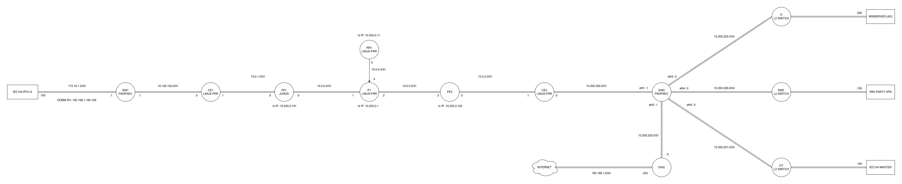

# energy-sector-ip-mpls-lab

IP/MPLS + IPsec lab for critical infrastructure telecom, built with Junos and Linux FRR routers.

It connects an electric substation (IEC-104 outstation) and a control center (IEC-104 client) through a dedicated service provider network, inspired by real life architectures used in CEE countries.

It carries traffic between both sites through the service provider network, with IPsec protecting the path between them.

This repo includes the configs and documentation from validation scenarios, including IPsec-encrypted IEC-104 protocol traffic.
